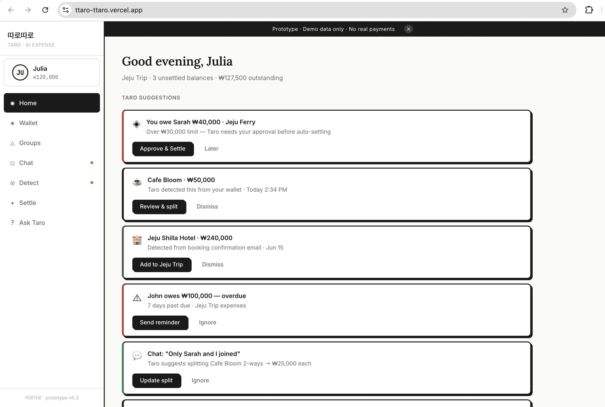

# 따로따로 · ttaro-ttaro — Split Bill AI Agent



> **따로따로** (romanized: *ttaro-ttaro*) means “separately” in Korean — the idea that everyone’s share is tracked precisely, separately, and fairly.

Across cultures, people have everyday words for splitting costs: 따로따로(ttaro-ttaro), 別々 / べつべつ (betsu-betsu), half-half, asing-asing, ครึ่ง-ครึ่ง (khrueng-khrueng), AA制 (AA zhì), and பாதி பாதி (paadhi paadhi). This shows that sharing expenses is universal, but the experience is still often awkward and manual.

따로따로 is an AI agent that acts as a group treasurer that detects, splits, explains, reminds, and settles shared expenses between friends, especially during trips, meals, outings, and temporary group activities with human approval (human-in-the-loop).

---

## Prototype

- **Vercel Deployment:** [ttaro-ttaro.vercel.app](https://ttaro-ttaro.vercel.app)
- **GitHub Repository:** [github.com/juliairsalina/ttaro-ttaro](https://github.com/juliairsalina/ttaro-ttaro)
- **5-Minute Video Explanation:** [Watch on YouTube](https://youtu.be/huNeX1EKiKU?si=bORPLC8QI2a_fEj6)
- **1-Page Project Overview (PDF):** [View PDF](https://github.com/juliairsalina/ttaro-ttaro/blob/main/1-page.pdf)
- 
---

## Why This Problem?

During group trips, dozens of shared expenses can happen across meals, transport, accommodation, and activities. Existing solutions often require someone to manually record each expense and later remind others to settle their balances.

This creates two problems:

1. **Administrative burden**  
   Someone has to remember the expense, record it, categorize it, select participants, calculate the split, and check who has paid.

2. **Social friction**  
   Someone has to ask friends for money, send reminders, and deal with the awkwardness of delayed repayment.

Many financial activities such as payments, transfers, and bookings are already automated. However, shared expense management still depends heavily on manual entry and interpersonal follow-up.

---

## Pain Point

> People find it tedious to manually record, categorize, and track shared expenses, especially during trips where multiple transactions happen every day.
> People feel uncomfortable reminding friends to repay shared expenses, creating social friction and awkward conversations.

I believe the deeper issue is not just the calculation but also coordination around money.

When friends share expenses, one person often becomes the unofficial “expense manager.” That person has to track payments, remind others, and sometimes feel uncomfortable asking for repayment.

---

## Inspiration

The idea was inspired by small but useful automation features, such as Apple detecting verification codes in messages before the user manually copies them.

This made me ask:

> What if shared expense management could also become proactive?

Instead of waiting for users to manually enter every expense, an AI agent could detect useful financial context ahead of time and suggest the next action.

---

## Proposed Solution

따로따로 is an AI agent that acts as a group treasurer.

Instead of only helping users calculate debts, 따로따로 helps with the full shared-expense process:

- detecting possible shared expenses
- understanding group context
- suggesting who should be included in a split
- calculating what each person owes
- explaining unclear balances
- drafting polite repayment reminders
- coordinating settlement through an in-app wallet
- keeping users in control through approval before important actions

The goal is to let 따로따로 handle the repetitive and socially uncomfortable parts, while the user stays in control.

---

## Who This Is For (Target Audience)

따로따로 is designed for **small social groups of 3–8 people** who frequently share expenses during trips, outings, or temporary group activities.

Examples include:

- friends travelling together
- friends going to cafes or restaurants
- exchange students
- classmates on group trips
- event committees
- club members
- roommates sharing occasional costs

The focus is on groups where shared expenses happen often enough that one person usually becomes responsible for managing the money.

---

## Why Current Workarounds Fall Short

People currently use:

- group chats
- bank transfers
- payment apps
- notes apps
- spreadsheets
- Splitwise or similar bill-splitting tools
- one person paying first and collecting later

These tools can help, but they still require users to do much of the work manually.

Current solutions usually help with tracking or calculation, but users still need to:

- manually enter expenses
- remember who joined each activity
- remind friends to pay
- verify repayments
- manage delayed payments
- handle awkward conversations

따로따로 explores how AI can help with the coordination layer, not just the calculation layer.

---

## Key Features

### 1. AI Expense Detection

따로따로 detects possible shared expenses from mock wallet transactions.

Example:

Julia pays ₩50,000 at a cafe.  
A normal cafe expense might be around ₩10,000 per person.  
따로따로 detects that this may be a group expense and asks whether it should be split with friends.

---

### 2. Human-in-the-Loop Approval

따로따로 can detect, suggest, explain, and prepare actions.

However, 따로따로 must ask for user approval before:

- creating a shared expense
- assigning debt to friends
- sending a repayment reminder
- moving money through the wallet
- enabling auto-settlement
- using messages, emails, or call transcripts as context

This is important because money requires trust. The app should feel automated, but not out of control.

---

### 3. In-App Wallet Settlement

The prototype includes a simulated wallet system.

Users can see:

- wallet balance
- top-up option
- withdrawal option
- wallet-to-wallet settlement
- transaction history
- pending balances

After approval, 따로따로 simulates automatic wallet-based settlement.

Example:

Julia paid ₩50,000 for Cafe.  
Each of five friends owes ₩10,000.  
After approval, the app simulates transfers from each friend’s wallet to Julia’s wallet.

---

### 4. Message Understanding

The prototype includes mock group and individual chats.

따로따로 can detect messages such as:

- “I’ll pay first.”
- “Let’s split later.”
- “Only Sarah and I joined.”
- “John wasn’t there.”

This helps 따로따로 suggest more accurate splits.

---

### 5. Voice / Video Call Transcript Detection

The prototype does not record real calls. It uses mock call transcripts.

Example transcript from voice call:

> “Sarah and Julia joined the cafe, but John and Alex did not.”

따로따로 uses this context to suggest that John and Alex should be excluded from the cafe split.

---

### 6. Email Booking Detection

The prototype simulates booking email detection.

Example email booking summary:

> Hotel booking confirmed — ₩240,000 — 4 guests

따로따로 can suggest adding the booking to the trip wallet and splitting it among the correct members.

---

### 7. Debt Visibility

The app shows who has settled and who is still pending.

Example statuses:

- settled
- pending
- overdue
- extension requested

This creates gentle accountability without directly shaming users.

---

### 8. Settlement Score

따로따로 can show mock repayment reliability indicators such as:

- 98% on-time payments
- reliable payer
- usually settles within 1 day
- extension requested

The purpose is to encourage repayment through soft accountability.

---

### 9. Flexible Repayment

Not every unpaid balance is caused by bad intention.

If someone cannot pay immediately, 따로따로 can suggest:

- pay later
- partial payment
- installments
- request extension

This helps reduce awkwardness while keeping the debt visible.

---

### 10. AI Explanation

Users can ask 따로따로:

- “Why do I owe ₩17,500?”
- “Who still owes me?”
- “How was this split?”

따로따로 explains the calculation clearly.

Example:

> You owe ₩17,500 from dinner, taxi, and hotel.  
> Dinner: ₩5,000  
> Taxi: ₩8,000  
> Hotel: ₩4,500

---

## What I Would Test First

The first thing I would test is whether the pain point is real.

The key validation question is:

> Are manual expense tracking and repayment reminders frustrating enough that people would actually want an AI assistant involved?

I would test this by showing the prototype to people who recently travelled, ate out, or shared costs with friends.

I would ask:

- How did you track shared expenses?
- Who managed the finances?
- Did anyone forget to pay?
- Was asking for repayment uncomfortable?
- Which part of the process felt most annoying?
- Which part would you most want automated?
- Would you trust an AI agent to suggest or prepare settlements?
- What would make you uncomfortable about this idea?

The success signal would be:

> Users consistently say that manual tracking and repayment reminders are frustrating enough that they would want everything automated.

If users only say the prototype looks nice but do not feel the pain point, then the idea needs to be changed.

---

## Prototype Scope

This is a **front-end prototype only**.

It uses mock data for:

- wallet transactions
- wallet balances
- group members
- messages
- emails
- call transcripts
- AI suggestions
- repayment reminders
- settlements

It does not use:

- real payments
- real bank accounts
- real emails
- real messages
- real call recordings
- real AI APIs
- real authentication

The purpose is to make the idea tangible quickly and test whether the problem and workflow make sense.

---

## Project Structure

```text
tttaro-ttaro-tttaro-ttaro/
├── index.html
├── style.css
├── script.js
└── README.md
```

## How to Run Locally

Clone the repository:

```text
git clone https://github.com/juliairsalina/ttaro-ttaro.git
cd ttaro-ttaro
```

Then
```text
open index.html
```

## 11. My Reflection

The biggest realization from this project is that the real pain is not only about math. At first, I thought the problem was about splitting bills faster, but the issue is more two-sided: people do not want to be the person who pays for everything and never gets paid back, and they also do not want to accidentally become the friend who forgets to repay others and loses trust.

That is why I framed Taro as a split bill agent instead of just another bill-splitting app. The problem is not only “how much does everyone owe?”, but also “who records it?”, “who reminds people?”, and “who keeps track when someone forgets?”

Manual entry also becomes more annoying than it sounds. During trips, small transactions happen repeatedly: cafes, taxis, tickets, meals, and bookings. People are already used to fast and automated services, especially in environments like South Korea where 빨리빨리 culture values quick and efficient workflows. Compared to that, shared expense tracking still feels very manual.

Taro is meant to reduce that burden without making users feel aggressive or calculative. It helps notice possible shared expenses, organize them, explain balances, draft reminders, and show settlement status clearly. The goal is to protect fairness and reduce awkward repayment conversations.

At the same time, money requires trust. That is why human-in-the-loop approval is important. Taro can detect, suggest, explain, and prepare actions, but the user should always approve before money is moved or messages are sent.

Through this project, my thinking changed from “make splitting bills faster” to “make shared money easier, fairer, and less socially uncomfortable.” The current prototype is still limited and uses mock data, but it helped make the idea tangible and test how the flow might feel.
